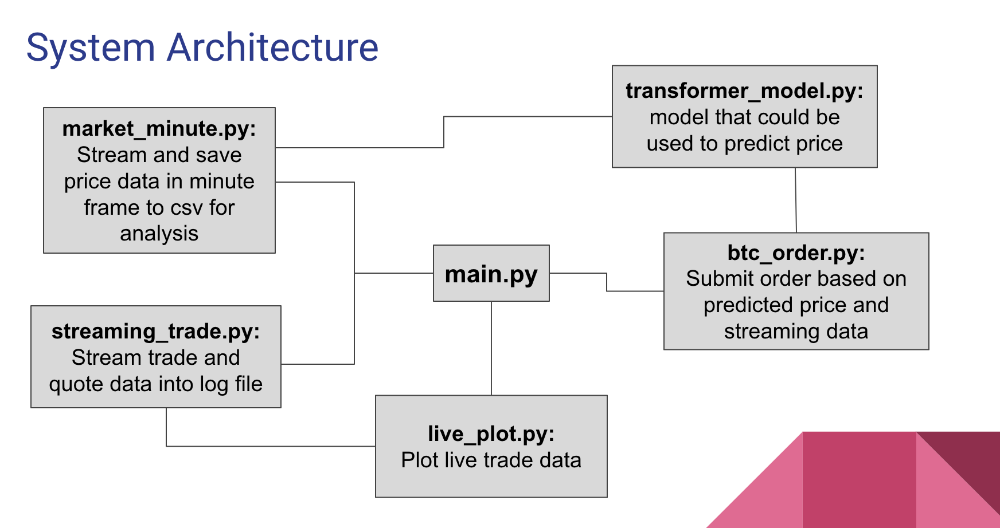

# Crypto Real Time Trading System

## Overview
* Leveraged Transformer AI Model, Alpaca API for optimized trade execution and enhanced decision making
* Effectively extracted and processed live market data, enabling prompt decision-making and executing orders with high accuracy and efficiency

## Tools
Python, Tensorflow, Alpaca API, asyncio, 

## System Architecture


## Structure
* **main.py:** Trigger streaming, plotting, loading data
* **market_minute.py:** Extract data in minute timeframe and save them under the price_bar_minute folder
* **streaming_trade.py:** Extract trade, quotes data in real-time manner and save them under the logging folder
* **live_plot.py:** Plot the trade data in live
* **transformer_model.py:** Layers of the BERT + Time embeddings model 
* **btc_order.py:** Submit order based on predicted price by transformer
* **model folder:** The final model is under this folder
* **requirements.txt:** Required packages is listed in this file
* **config.ini:** Configuration info is listed in this file

## Steps to Run
1. Install the dependency
```
pip install requirements.txt
```
2. Clone the repository
```
git clone https://github.com/ChenFengTsai/Speech_Emotion_Summary_API.git
```
3. Run different function
* Get bar data in minute timeframe with market_minute.py
```
python3 main.py --symbols BTC/USD ETH/USD --func collector
```
* Stream real time trade and quote data
```
python3 main.py --symbols BTC/USD ETH/USD --func stream
```
* Plot live plot with trade information
```
python3 main.py --symbols BTC/USD ETH/USD --func plot
```
* Submit bitcoin order based on transformer model
```
python3 main.py --func run_order --script btc_order.py
```
Since the transformer model I built is only training on BTC data, I can now only make prediction for BTC and submit BTC order.


